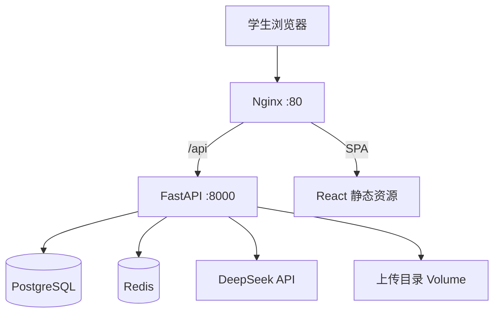

# Offer 捕手 — 系统架构

## 架构图

## 模块划分

| 模块 | 路径 | 职责 |
|------|------|------|
| 认证 | `api/v1/auth.py` | 注册、登录、JWT |
| 画像 | `api/v1/profile.py` | 求职意向 CRUD |
| 简历 | `api/v1/resumes.py` | 上传、解析、优化 |
| 岗位 | `api/v1/jobs.py` | 列表、详情 |
| 匹配 | `api/v1/match.py` | 推荐、报告 |
| 对话 | `api/v1/chat.py` | 会话、Agent |
| LLM | `llm/client.py` | DeepSeek 调用 |
| 匹配引擎 | `services/matching.py` | 规则 + LLM 精排 |
| Agent | `services/agent.py` | 上下文组装与回复 |

## 匹配流水线

1. SQL 拉取岗位全集（可按城市/类型过滤）
2. 规则分预排序（意向城市、岗位关键词）
3. Top8 调用 DeepSeek 结构化打分
4. 按综合分排序返回 Top-K

## 前端路由

| 路径 | 页面 |
|------|------|
| `/login` | 登录 |
| `/register` | 注册 |
| `/` | 对话主界面（DeepSeek 风格） |
| `/profile` | 求职意向 |
| `/match` | 岗位库匹配 |
