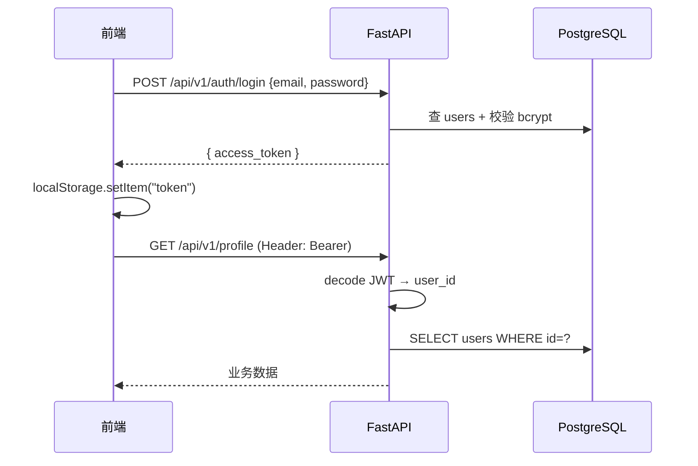

# Offer 捕手 — 登录与认证设计

## 1. 认证方案概览

采用 **无状态 JWT（Bearer Token）**，不依赖服务端 Session 表。

| 环节 | 实现 |
|------|------|
| 密码存储 | bcrypt（`passlib`） |
| 令牌签发 | HS256 JWT，`sub` = 用户 ID |
| 接口鉴权 | `Authorization: Bearer <token>` |
| 前端存 Token | `localStorage` 键名 `token` |
| 登出 | 前端删除 `token`（无服务端黑名单） |



## 2. API 接口

| 方法 | 路径 | 认证 | 说明 |
|------|------|------|------|
| POST | `/api/v1/auth/register` | 否 | 注册并发送验证邮件（不返回 token） |
| POST | `/api/v1/auth/resend-verification` | 否 | 重发验证邮件 |
| GET | `/api/v1/auth/verify-email?token=` | 否 | 验证邮箱，成功返回 token |
| POST | `/api/v1/auth/login` | 否 | 登录（需已验证邮箱） |
| GET | `/api/v1/auth/me` | 是 | 当前用户信息（需已验证） |

### 注册请求 / 响应

```http
POST /api/v1/auth/register
Content-Type: application/json

{
  "email": "student@example.com",
  "username": "张三",
  "password": "your_password"
}
```

```json
{
  "message": "验证邮件已发送，请查收邮箱完成验证后再登录",
  "email": "student@example.com",
  "dev_verify_url": "http://localhost:8080/verify-email?token=..."
}
```

`dev_verify_url` 仅在 **未配置 SMTP** 且 `EXPOSE_DEV_VERIFY_LINK=true` 时返回；生产环境配置 SMTP 后不会返回。

用户点击邮件（或开发链接）访问 `GET /api/v1/auth/verify-email?token=...` 或前端 `/verify-email?token=...`，验证成功后获得 `access_token`。

注册时会同时创建空的 `student_profiles` 记录；`users.email_verified` 默认为 `false`。

### 登录

```http
POST /api/v1/auth/login

{"email": "demo@student.edu", "password": "demo1234"}
```

失败返回 `401`，`detail`: `邮箱或密码错误`。  
未验证邮箱返回 `403`，`detail`: `邮箱尚未验证，请查收邮件或重发验证链接`。

## 3. 邮箱验证（SMTP）

| 变量 | 说明 |
|------|------|
| `APP_PUBLIC_URL` | 前端根地址，生成验证链接 |
| `EMAIL_VERIFY_EXPIRE_HOURS` | 链接有效期（默认 24h） |
| `EXPOSE_DEV_VERIFY_LINK` | 未配 SMTP 时是否在 API/日志暴露链接 |
| `SMTP_HOST` / `SMTP_PORT` / `SMTP_USER` / `SMTP_PASSWORD` / `SMTP_FROM` | 生产发信 |
| `SMTP_USE_TLS` | 默认 `true` |

开发：不配 SMTP 时，注册响应与 `docker compose logs api` 会打印验证链接。  
演示账号 `demo@student.edu` 种子数据为已验证状态。

## 4. JWT 配置（`.env`）

| 变量 | 默认值 | 说明 |
|------|--------|------|
| `JWT_SECRET` | 开发用固定串 | **生产必须改为长随机串** |
| `JWT_ALGORITHM` | `HS256` | |
| `JWT_EXPIRE_MINUTES` | `10080`（7 天） | 过期后需重新登录 |

载荷示例：

```json
{
  "sub": "1",
  "exp": 1735689600
}
```

## 5. 后端鉴权流程

1. `HTTPBearer` 从 Header 取 token（`app/core/deps.py` → `get_current_user`）
2. `decode_access_token` 校验签名与过期（`app/core/security.py`）
3. 用 `sub` 查 `users` 表；不存在则 401

受保护路由通过 `user: User = Depends(get_current_user)` 注入当前用户。

## 6. 前端行为

| 文件 | 行为 |
|------|------|
| `frontend/src/api/client.ts` | 请求自动带 `Authorization`；**401 时清 token 并跳转 `/login`** |
| `frontend/src/pages/LoginPage.tsx` | 登录成功后 `setToken` + 跳转首页 |
| `frontend/src/pages/RegisterPage.tsx` | 注册 → 待验证页 |
| `frontend/src/pages/RegisterPendingPage.tsx` | 重发验证、开发链接 |
| `frontend/src/pages/VerifyEmailPage.tsx` | 点击邮件链接验证 |
| `frontend/src/App.tsx` | 路由守卫（无 token 访问需登录页） |

## 7. DeepSeek API Key（与登录分离）

用户可在侧边栏保存个人 DeepSeek Key：

| 存储 | 字段 `users.encrypted_api_key` |
| 加密 | Fernet，密钥由 `JWT_SECRET` 派生（`app/core/crypto.py`） |
| 使用优先级 | 用户 Key > 服务端 `.env` 的 `DEEPSEEK_API_KEY` |

接口：`GET/PUT/DELETE /api/v1/settings/api-key`（均需登录）。

## 8. 安全建议（生产）

1. 使用强随机 `JWT_SECRET`，勿提交到 Git  
2. HTTPS 全站；`localStorage` 在 XSS 下有风险，生产可考虑 HttpOnly Cookie + CSRF 防护  
3. 增加登录失败限流（可接 Redis，见缓存文档）  
4. 配置 SMTP 发信；生产关闭 `EXPOSE_DEV_VERIFY_LINK` 或设为 `false`  
5. 可选：Refresh Token、密码强度策略  

## 9. 相关代码

| 路径 | 职责 |
|------|------|
| `backend/app/api/v1/auth.py` | 注册 / 验证 / 登录 / me |
| `backend/app/services/email_sender.py` | SMTP 发信 |
| `backend/app/services/email_verification.py` | 令牌与验证逻辑 |
| `backend/app/core/security.py` | 哈希与 JWT |
| `backend/app/core/deps.py` | 当前用户依赖 |
| `frontend/src/api/client.ts` | Token 读写与 401 处理 |
